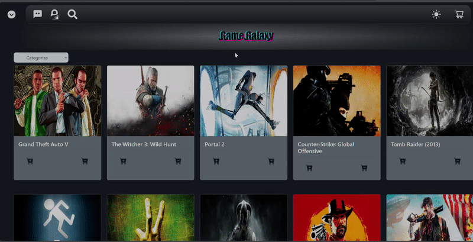
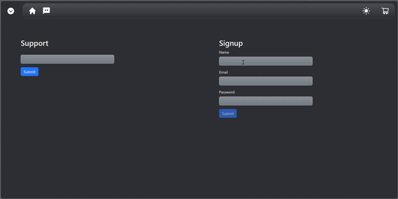
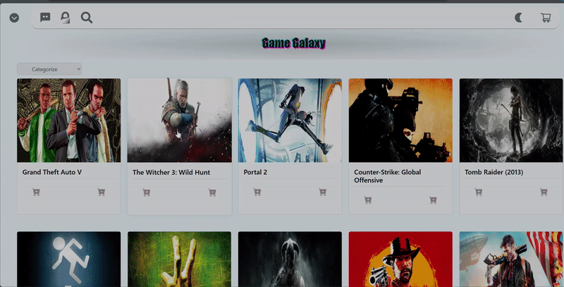

# GameGalaxy

## This is a Game Information platform with an emphasis on Clean and Responsive UI/UX

</br>


</br>

## Dynamic Search Bar

</br>




</br>

## Working Form Validation and Review System

</br>




</br>

## Details Page Showing Price of Games with links to associated retailers

</br>



</br>

### How to run

```
cd to my-app
npm run dev
Cntrl-click link or use shortcut "o" in console
```

***

## Planned Updates
- [ ] Full integration with dedicated backend and database
- [ ] User Profile with saved games
- [ ] On site live chat functionality

***This Project was made possible due to the hard work of devs present at RAWG and ITAD***
</br>

[Visit RAWG](https://rawg.io/) 🚀
</br>

[Visit ITAD](https://isthereanydeal.com/) 🚀


